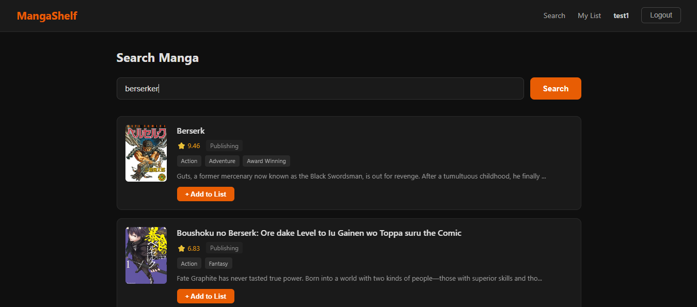
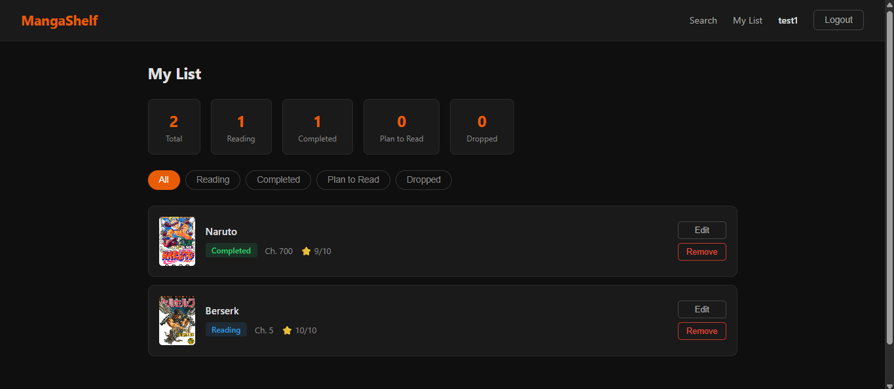
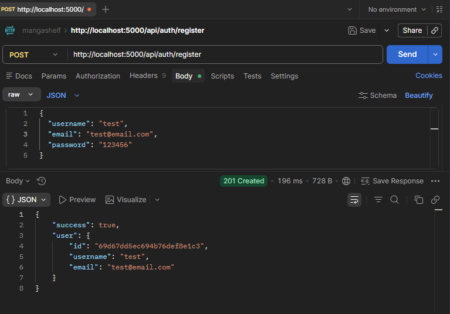
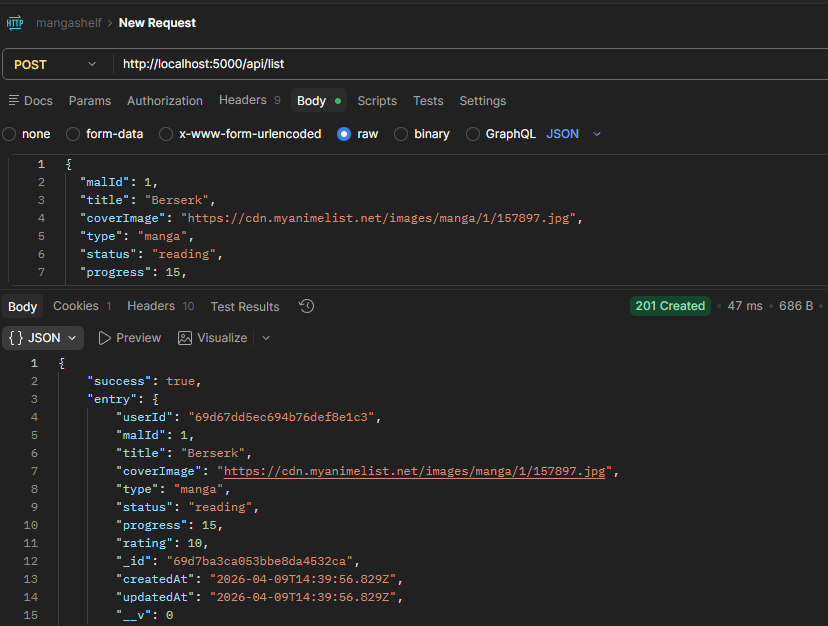
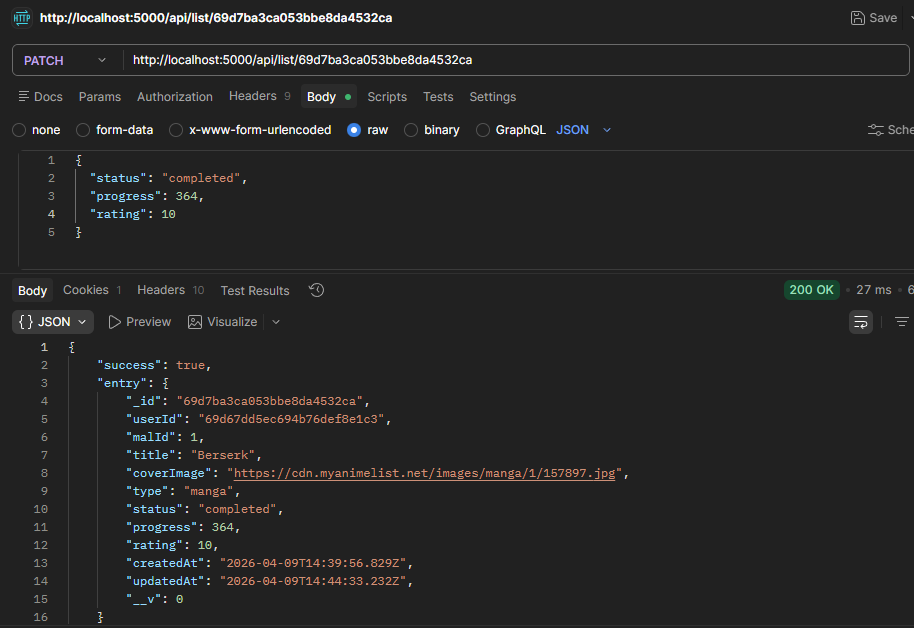
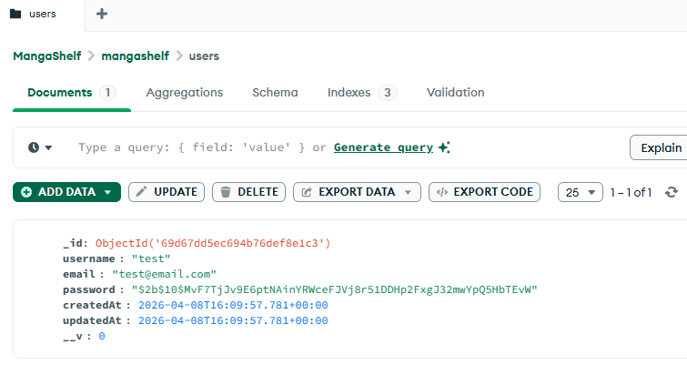

# MangaShelf 📚

MangaShelf is a full-stack MERN web application that allows users to search for manga, track their reading progress, and manage personal reading lists. 

This project was built to handle complex state management on the frontend while maintaining secure, robust RESTful API interactions and database syncing on the backend.

## 🚀 Features

- **Secure User Authentication:** Custom registration and login system utilizing JSON Web Tokens (JWT) and encrypted passwords.
- **Dynamic Search:** Browse for manga titles, cover art, and descriptions utilizing the Jikan (MyAnimeList) API.
- **Personalized Dashboard:** Track your library by categorizing entries (Reading, Completed, Plan to Read, Dropped).
- **Full CRUD Functionality:** 
  - **Create:** Add new manga to your list.
  - **Read:** Fetch and filter your personalized dashboard.
  - **Update:** Edit reading status, chapter progress, and personal ratings.
  - **Delete:** Remove entries from your list.

## 🛠️ Tech Stack

**Frontend:**
- React (via Vite)
- Context API (for State Management)
- CSS (for responsive UI styling)

**Backend:**
- Node.js & Express.js
- MongoDB & Mongoose (Database & Schema Modeling)
- JSON Web Tokens (JWT) & bcrypt (Authentication & Security)

---

## 📸 Project Screenshots

### Frontend UI
*Clean, responsive interface for searching and managing your manga library.*

**Search Interface**


**User Dashboard (My List)**


### Backend & API Testing
*Extensive backend testing to ensure secure routing and reliable database mutations.*

**User Authentication via Postman**


**Adding and Updating Entries (POST & PATCH)**



**Search Query Route**


**MongoDB Compass Database Sync**


---

## 💻 Running the Project Locally

This repository contains both the `client` (frontend) and `server` (backend) environments. You will need to start both to run the application fully.

### Prerequisites
- Node.js installed
- A local MongoDB instance (like MongoDB Compass) or a MongoDB Atlas URI

### 1. Clone the repository
```bash
git clone https://github.com/singhkailash9/mangashelf.git
cd mangashelf
```
### 2. Backend Setup
```Bash
cd server
npm install
```
Create a .env file in the server directory and add the following variables:
```
PORT=5000
MONGO_URI=your_mongodb_connection_string
JWT_SECRET=your_super_secret_jwt_key
```

Start the backend server:
```Bash
npm run dev
```
### 3. Frontend Setup
Open a new terminal window/tab:

```Bash
cd client
npm install
```
Start the Vite development server:

```Bash
npm run dev
```
### 4. Open the App
Navigate to `http://localhost:5173/` in your browser.

---
💡 Notes
- Search functionality relies on the public Jikan API. If searches are returning empty or timing out, the Jikan API may be temporarily down or rate-limiting requests.